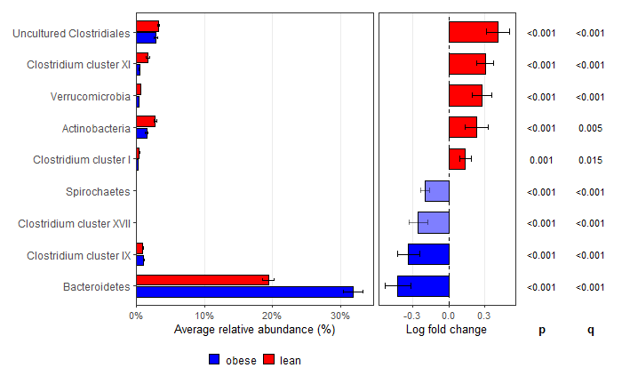

[](https://doi.org/10.5281/zenodo.21289123) [](https://github.com/KitHubb/ancombcVizhelper/releases)


# ancombcVizhelper

`ancombcVizhelper` provides helper functions for organizing and visualizing
differential-abundance results generated by `ANCOMBC::ancombc2()`.

The package does not re-implement the ANCOM-BC2 statistical method. It focuses
on visualization of the ANCOM-BC2 result objects:

- `res`: primary regression coefficients
- `res_global`: taxon-level global test results
- `res_pair`: pairwise directional comparisons
- `res_dunn`: Dunnett-type comparisons against a reference group
- `res_trend`: trend-test results
- `zero_ind`: structural-zero indicators

## Installation

```r
pak::pak("KitHubb/ancombcVizhelper")
```


## Quick start

The input must be the complete object returned by `ANCOMBC::ancombc2()`.

```r
library(ancombcVizhelper)

global_heatmap <- make_heatmap(
  out = output,
  result = "res_dunn",
  prefix = "bmi",
  title = "Global ANCOM-BC2 BMI-associated families",
  sensitivity = "keep",
  show_all = FALSE, 
  groupnames = TRUE
)
```

```r
global_barplot <- ancombcVizhelper::make_barplots(
  out = output,
  result = "res_global",
  prefix = "bmi",
  title = "BMI coefficients for globally significant families",
  sensitivity = "keep",
  show_all = FALSE,
  group_order = "mean",
  order = "asc",  
  groupnames = FALSE

)

global_barplot$plot
```

```r

dunn_abundance <- ancombcVizhelper::make_abundance_lfc_plot(
  ps = ps,
  out = output,
  result = "res_dunn",
  prefix = "bmi",
  group = "bmi",
  tax_level = "Family",
  comparison = "lean",
  groupnames = FALSE,
  abundance_groups = c("overweight", "lean")
)

dunn_abundance$plot

```

## Interpretation

### Heatmap

- Red tiles indicate positive log-fold changes; blue tiles indicate negative
  log-fold changes.
- For `res`, `res_pair`, and `res_dunn`, white tiles indicate contrasts not
  selected under the current significance and sensitivity settings.
- For `res_global` and `res_trend`, taxa are selected by a taxon-level test.
  Displayed log-fold changes are fitted group coefficients and do not represent
  separate pairwise significance tests.
- Structural-zero taxa are excluded because standard ANCOM-BC2 log-fold-change
  estimates are not defined for them.

### Bar plot

- Red bars indicate positive log-fold changes; blue bars indicate negative
  log-fold changes.
- Error bars represent ±1 standard error of the estimated log-fold change.
- All panels use the same log-fold-change scale.
- Fully opaque bars are significant and pseudo-count sensitivity-robust
  (`diff = TRUE` and `passed_ss = TRUE`).
- Semi-transparent bars either are not significant or did not pass the
  pseudo-count sensitivity analysis.

## Example output

Create and commit the PNG files first, then remove these comment markers.

### Global-test heatmap


### Global-test bar plot


### Dunn-test abundance & lfc plot




## Reproducing the example figures

The figures are generated from the `atlas1006` workflow in:

[`vignettes/ancombc2-atlas1006-workflow.Rmd`](vignettes/ancombc2-atlas1006-workflow.Rmd)


After confirming the images, remove the HTML comment markers in the
`Example output` section and commit the PNG files together with `README.md`.

## Selecting an ANCOM-BC2 result table

| Result | Recommended use |
|---|---|
| `res` | Continuous covariates or a single coefficient. |
| `res_global` | Selecting taxa with an overall difference across groups. |
| `res_pair` | All pairwise directional comparisons with mdFDR control. |
| `res_dunn` | Comparisons of each group against a predefined reference group. |
| `res_trend` | Ordered trend testing across groups. |


### R packages used

| Package | Version |
|---|---:|
| ANCOMBC | 2.12.1 |
| ancombcVizhelper | 1.0.2 |
| base | 4.5.2 |
| grid | 4.5.2 |
| knitr | 1.51 |
| lme4 | 2.0.1 |
| microbiome | 1.32.0 |
| patchwork | 1.3.2 |
| phyloseq | 1.54.2 |
| renv | 1.2.3 |
| rmarkdown | 2.31 |
| scales | 1.4.0 |
| testthat | 3.3.2 |
| tidyverse | 2.0.0 |
| ggpicrust2 | 1.7.1 |

### Key methodological and visualization references

Lin H, Peddada SD. Multigroup analysis of compositions of microbiomes with
covariate adjustments and repeated measures. *Nature Methods*. 2024;21:83–91.
https://doi.org/10.1038/s41592-023-02092-7

McMurdie PJ, Holmes S. phyloseq: An R package for reproducible interactive
analysis and graphics of microbiome census data. *PLoS ONE*. 2013;8:e61217.
https://doi.org/10.1371/journal.pone.0061217

Wickham H. *ggplot2: Elegant Graphics for Data Analysis*. Springer-Verlag;
2016. https://ggplot2.tidyverse.org

Yang C, Mai J, Cao X, Burberry A, Cominelli F, Zhang L. ggpicrust2: an R
package for PICRUSt2 predicted functional profile analysis and visualization.
*Bioinformatics*. 2023;39(8):btad470.
https://doi.org/10.1093/bioinformatics/btad470
