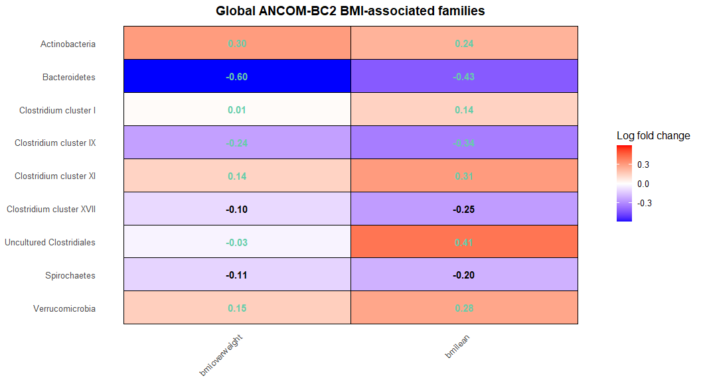
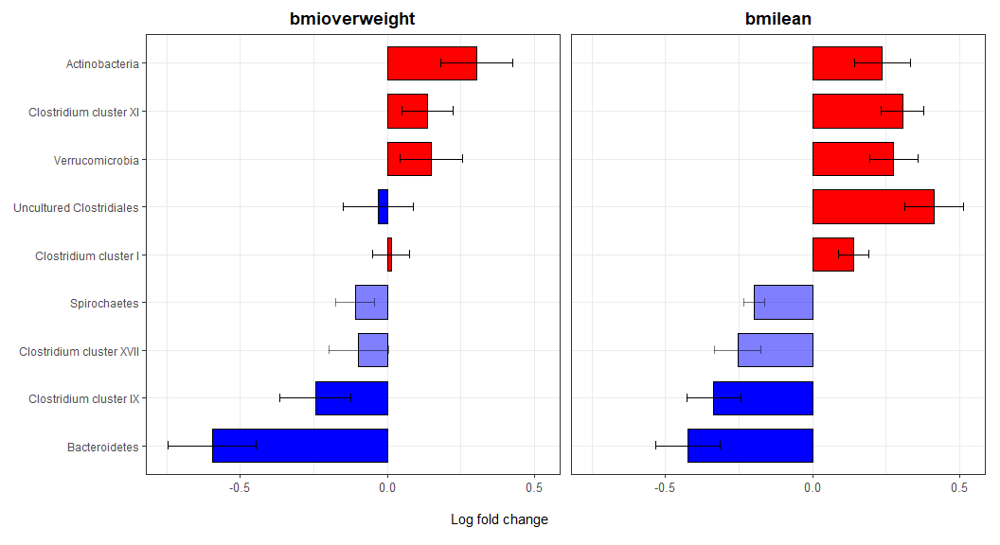

# ancombcVizhelper

`ancombcVizhelper` provides helper functions for organizing and visualizing
differential-abundance results generated by `ANCOMBC::ancombc2()`.

The package does not re-implement the ANCOM-BC2 statistical method. It focuses
on visualization of the ANCOM-BC2 result objects:

- `res`: primary regression coefficients
- `res_global`: taxon-level global test results
- `res_pair`: pairwise directional comparisons
- `res_dunn`: Dunnett-type comparisons against a reference group
- `res_trend`: trend-test results
- `zero_ind`: structural-zero indicators

## Installation

```r
pak::pak("KitHubb/ancombcVizhelper")
```

To install a tagged release:

```r
pak::pak("github::KitHubb/ancombcVizhelper@v1.0.0")
```


## Quick start

The input must be the complete object returned by `ANCOMBC::ancombc2()`.

```r
library(ancombcVizhelper)

global_heatmap <- make_heatmap(
  out = output,
  result = "res_global",
  prefix = "bmi",
  title = "Global ANCOM-BC2 BMI-associated families",
  sensitivity = "keep",
  show_all = FALSE
)

global_heatmap$plot
```

```r
global_barplot <- make_barplots(
  out = output,
  result = "res_global",
  prefix = "bmi",
  title = "BMI coefficients for globally significant families",
  sensitivity = "keep",
  show_all = FALSE,
  group_order = "mean",
  order = "asc"
)

global_barplot$plot
```

## Interpretation

### Heatmap

- Red tiles indicate positive log-fold changes; blue tiles indicate negative
  log-fold changes.
- For `res`, `res_pair`, and `res_dunn`, white tiles indicate contrasts not
  selected under the current significance and sensitivity settings.
- For `res_global` and `res_trend`, taxa are selected by a taxon-level test.
  Displayed log-fold changes are fitted group coefficients and do not represent
  separate pairwise significance tests.
- Structural-zero taxa are excluded because standard ANCOM-BC2 log-fold-change
  estimates are not defined for them.

### Bar plot

- Red bars indicate positive log-fold changes; blue bars indicate negative
  log-fold changes.
- Error bars represent ±1 standard error of the estimated log-fold change.
- All panels use the same log-fold-change scale.
- Fully opaque bars are significant and pseudo-count sensitivity-robust
  (`diff = TRUE` and `passed_ss = TRUE`).
- Semi-transparent bars either are not significant or did not pass the
  pseudo-count sensitivity analysis.

## Example output

Create and commit the PNG files first, then remove these comment markers.

### Global-test heatmap



### Global-test bar plot




## Reproducing the example figures

The figures are generated from the `atlas1006` workflow in:

[`vignettes/ancombc2-atlas1006-workflow.Rmd`](vignettes/ancombc2-atlas1006-workflow.Rmd)


After confirming the images, remove the HTML comment markers in the
`Example output` section and commit the PNG files together with `README.md`.

## Selecting an ANCOM-BC2 result table

| Result | Recommended use |
|---|---|
| `res` | Continuous covariates or a single coefficient. |
| `res_global` | Selecting taxa with an overall difference across groups. |
| `res_pair` | All pairwise directional comparisons with mdFDR control. |
| `res_dunn` | Comparisons of each group against a predefined reference group. |
| `res_trend` | Ordered trend testing across groups. |

## Citation

Please cite the ANCOMBC package and the ANCOM-BC2 publication when using this
package for scientific work.
